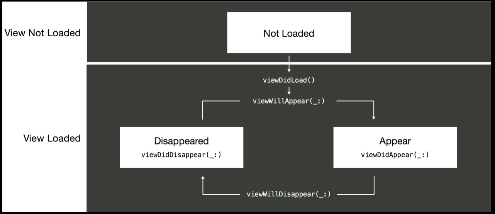
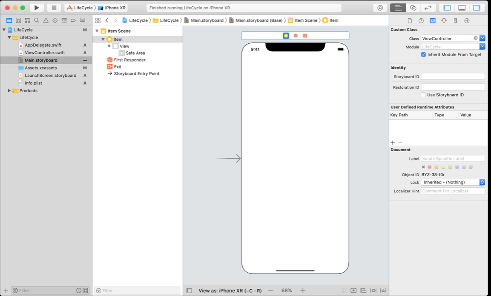
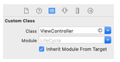
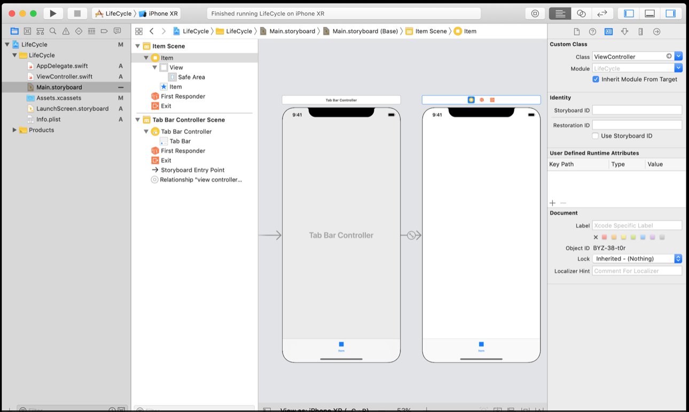
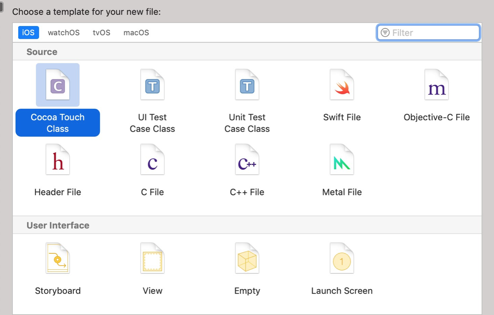

## CIS-444: View Controller Life Cycle

Now that you've learned the basics of Interface Builder, you know that view controllers are the foundation of your app's internal structure. Every app has at least one view controller, and most apps have several.
This lesson will explain more about the view controller life cycle so you can understand the infinite potential of this important class.

### What You'll Learn
* Appropriate times to perform work within the view controller life cycle
* How to add and remove views from the view hierarchy


When you've finished setting up views and view hierarchy, you'll need to move on to writing the logic behind your app. Your view controller classes are responsible for displaying your user's data and handling user interactions. In the Light project, you used a UIViewController subclass to manage the button tapping events through actions, and updated the view's background color accordingly. A view controller also controls the creation of its views, handles events based on the state of the view as it progresses through its life cycle, and disposes of its views when they're no longer needed.

### View Controller Life Cycle
In iOS, view controllers can be found in one of several different states:
* View not loaded
* View appearing
* View appeared
* View disappearing
* View disappeared

As the view transitions from one state to another, iOS calls SDK-defined methods, which you can implement in your code. In the figure below, you can see the name of each method that gets called when a state transition occurs.



You probably noticed a pattern in the method names. Once the view is loaded, the methods come in pairs: "will" and "did." This standard Apple design pattern allows you to write code before and after the named event occurs. However, it's important to note that it's possible to have a "will" callback without the corresponding "did" callback. For example, `viewWillDisappear(_:)` could be called without `viewDidDisappear(_:)` ever happening.

While every app is different, you'll learn the guidelines for each of the view controller life cycle methods and the specific types of tasks associated with them.

To gain tangible experience with the view controller life cycle, you'll build an app that prints messages to the console describing each life cycle method as it is called. As you learn more about different life cycle methods, you'll add to the project.

#### Create Lifecycle Project
1. In Xcode, create a new project using the Single View App template. Name the project "LifeCycle.”

### View Did Load
After you've instantiated a view controller, whether from a storyboard or programmatically, the view controller will load the view into memory. This process creates the views that the controller will manage.

After a view controller has finished loading its particular views, its aptly named `viewDidLoad()` function is called, giving the controller a chance to perform work that depends on the view being loaded and ready. Other types of setup tasks to perform in `viewDidLoad()` include additional initialization of views, network requests, and database access.

To add custom implementations of the view controller life cycle methods, you'll need to know the class associated with the view controller scene in question. 

1. In LifeCycle, open `Main.storyboard` to reveal its view controller. Select the view controller and use the Identity inspector to reveal its subclass.



In the Class field, you'll see a white arrow inside a gray circle—which provides you with a shortcut to the class. Click the arrow to open the associated `.swift` file, `ViewController.swift`.



2. Add the following to the end of the `viewDidLoad()` function:

```swift
print("ViewController - View Did Load")
```

This line will print to the console the string "ViewController - View Did Load" any time `viewDidLoad()` is called.

3. Build and run your app. In the console pane, you should see your message after the view loads.


### View Event Management

Some units of work may only be performed one time—for example, updating a label's font, text, or color. For those tasks, `viewDidLoad()` is the most appropriate place to do it.

For work that will be performed multiple times, your app can rely on view event notifications. When the visibility of its views changes, a view controller will automatically call its life cycle methods—allowing you to respond to the change in view state.

These methods include:
* `viewWillAppear(_:)`
* `viewDidAppear(_:)`
* `viewWillDisappear(_:)`
* `viewDidDisappear(_:)`

Take a look at the documentation. You may notice that each of these methods requires you to call the superclass' version at some point in your implementation. 

One way to understand why this needs to happen is to think of the following: when you write your custom view controller subclass and want to use life cycle methods (including viewDidLoad()), you will get an error if you do not use the override keyword. This is because the superclass already contains definitions for these methods.  Using the `override` keyword overrides the implementation in the superclass, `UIViewController` in this case, and allows your implementation of this method to be executed instead of the superclass' implementation.

However, since you don't know the implementation of `UIViewController`'s life cycle methods, you could be creating unexpected issues by not letting the superclass' code run. `UIViewController` could be doing important work that your app needs to function properly. To fix this, you can explicitly call the superclass' version of the method using the super keyword. Now both your code and `UIViewController`'s code will run.

Generally, the call to the superclass' implementation will be the first line of your overridden method.

```swift
“override func viewWillAppear(_ animated: Bool) {
    super.viewWillAppear(animated)
    // Add your code here
}
```

#### View Will Appear and View Did Appear
After `viewDidLoad()`, the next method in the view controller life cycle is `viewWillAppear(_:)`. This is called right before the view appears on the screen. *This is an excellent place to add work that needs to be performed before the view is displayed (and every time it's displayed) to the user.*

For example, if your view displays information relative to the user's location, you may want to request the location in `viewWillAppear(_:)`. That way, the view can be updated to take advantage of the new location. Other tasks include: starting network requests, refreshing or updating views (such as the status bar, navigation bar, or table views), and adjusting to new screen orientations.

As you'd expect, `viewDidAppear(_:)` is called after the view appears on the screen. If your work needs to be performed each time the view appears—but may require more than a couple of seconds—you'll want to place it in `viewDidAppear(_:)`. This way, your view will display quickly as your function continues to execute.
Use the `viewDidAppear(_:)` method for starting an animation or for other long-running code, such as fetching data.

1. To continue exploring the life cycle, override the function `viewWillAppear(_:)`.

```swift
“override func viewWillAppear(_ animated: Bool) {
 
}
```

2. Since you're writing your own custom implementation of `viewWillAppear(_:)`, don't forget to call the super class version of `viewWillAppear(_:)`. Since the call to `viewWillAppear(_:)` requires the animated property, you can pass along the parameter given to the subclass.

```swift
override func viewWillAppear(_ animated: Bool) {   
    super.viewWillAppear(animated)    
}
```

3. Next, add a print statement so you can check the order of the life cycle methods:

```swift
“print("ViewController - View Will Appear")
```
4. A similar print statement to `viewDidAppear(_:)`

5. Build and run your app. 

You should see three statements printed in your console. Refer to the view controller state diagram above, and see if you can trace the view's transitions:


#### View Will Disappear and View Did Disappear
You've probably already guessed that `viewWillDisappear(_:)` is called before the view disappears from the screen. This method executes when the user navigates away from the screen by tapping the back button, switching tabs, or presenting or dismissing a modal screen. *You can use the `viewWillDisappear(_:)` method for saving edits, hiding the keyboard, or canceling network requests.*

The last method in the life cycle is `viewDidDisappear(_:)`, which is called after the view disappears from the screen—typically after the user has navigated to a new view. If this method executes, it is certain the view has disappeared. As such, this method gives you an opportunity to stop services related to the view, for example, playing audio or removing notification observers.

Now take a moment to return to the LifeCycle project. In your `ViewController` class, add and override the "will" and "did" functions for the disappear view event. Add print statements so you can see the life cycle events.
For your view to disappear, you'll need to add a second view controller. Otherwise, there'd be no way to navigate from the current view. But first, you'll add a tab bar controller to handle navigation.

#### Putting it all together

1. Open `Main.storyboard`. Select the ViewController scene and embed it in a tab bar controller.



2. Drag a view controller from the Object library, and add it as a second tab in the tab bar controller. Feel free to organize the storyboard and update the background color of the view controllers


3. To write custom code for the new view controller, you'll have to add a new `.swift` file. From the Xcode menu bar, choose File > New > File (or Command-N). Then select Cocoa Touch Class and click Next.



4. “Name the new class "SecondViewController" and make sure the Subclass field is set to `UIViewController`.


### Additional Resources:
* View Controller Programming Guide for iOS
* API Reference: UIViewController
